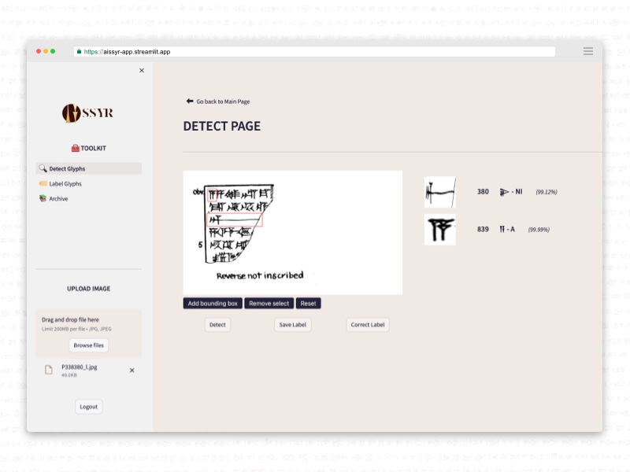

<a name="readme-top"></a>

<!-- PROJECT LOGO -->
<br />
<div align="center">
  <a href="https://github.com/CharleyDL/Aissyr">
    
  </a>

  <br />

  <p align="center">
    <br/>
    <br/>
    <a href="https://aissyr-app.streamlit.app"><strong>View Demo</strong></a>
    ·
    <a href="https://github.com/CharleyDL/Aissyr/issues">Report Bug</a>
    ·
    <a href="https://github.com/CharleyDL/Aissyr/issues">Request Feature</a>
  </p>
</div>

<br/>

<!-- TABLE OF CONTENTS -->
<details>
  <summary>Table of Contents</summary>
  <ol>
    <li><a href="#about-the-project">About The Project</a></li>
    <li><a href="#current-features">Current Features</a></li>
    <li><a href="#built-with">Built With</a></li>
    <li><a href="#getting-started">Getting Started</a></li>
      <ul>
        <li><a href="#prerequisites">Prerequisites</a></li>
        <li><a href="#installation">Installation</a></li>
      </ul>
    <li><a href="#acknowledgments">Acknowledgments</a></li>
  </ol>
</details>

<br/>

<!-- ABOUT THE PROJECT -->

## 📚 - About The Project

<br/>

<blockquote>
  <p>
    <em>
      This project showcases the expertise necessary to achieve the professional qualification of 
        <a href="https://www.francecompetences.fr/recherche/rncp/34757">
          Artificial Intelligence Developer (RNCP 34757)
        </a>
      , as part of the 
        <a href="https://isen-caen.fr/ecole-ia-microsoft-by-simplon-et-isen-ouest/">
          Microsoft IA Caen School by Simplon x ISEN (Engineer School)
        </a>. 
      AIssyr is an original creation by 
        <a href="https://www.linkedin.com/in/charleylebarbier/">
          Charley ∆. Lebarbier
        </a>
    </em>
  </p>
</blockquote>

<br/>
<br/>

<div align="center">
    
</div>



<br/>
<br/>

<p align="center">
  <em>
    AIssyr Web App is dedicated to researchers to work on the Assyrian 
    cuneiforms writing system, providing a toolbox for glyphs classification and labeling images.
  </em>
</p>

<br/>

## 🧰 - Current Features

- [x] Login and Sign up on App
- [x] Glyph Classification IA Model (_currently 22 Glyphs recognition_)
- [x] Prediction Select Tool
- [x] Labeling Select Tool
- [x] Archive Consultation
- [x] API
  - [x] account route
  - [x] prediction route
  - [x] labelling route
  - [x] resources route

<p align="right">(<a href="#readme-top">back to top</a>)</p>

## 🛠️ - Built With

<p align="center">
    
    
    
    
    
    
    
    
    
    
</p>

<p align="right">(<a href="#readme-top">back to top</a>)</p>

<!-- GETTING STARTED -->

## 🏁 - Getting Started

### Repository Content

<br/>

| Branch                                                                  | Description                                                                                       |
| ----------------------------------------------------------------------- | ------------------------------------------------------------------------------------------------- |
| [API](https://github.com/CharleyDL/Aissyr/tree/API)                     | API to connect Streamlit with Database                                                            |
| [App_Streamlit](https://github.com/CharleyDL/Aissyr/tree/App_Streamlit) | Streamlit web app to deploy                                                                       |
| [Database](https://github.com/CharleyDL/Aissyr/tree/Database)           | Scripts for initializing and deploying the database, along with the project's data.               |
| [EDA](https://github.com/CharleyDL/Aissyr/tree/EDA)                     | EDA Notebooks utilized for acquiring deeper insights into the data.                               |
| [Model](https://github.com/CharleyDL/Aissyr/tree/Model)                 | All AI architectures we train to compare them - currently _Glyphnet_DO65_ is used in this project |

### Prerequisites

1. Fork the repo and give a star
   ```sh
   git clone https://github.com/CharleyDL/Aissyr.git
   ```

### Installation

<blockquote>
  This installation guide has not been tested, still in construction.
  USE WITH CAUTION!
</blockquote>

<br/>

<details>
  <summary>Local Installation</summary>
    <ol>
      <li>
        Create a local Python Virtual Environment _(with venv or alt.)
        <code>python -m venv .env</code><br/>
        <code>source .env/bin/activate</code><br/>
        <b>On Windows</b>, use <code>.env\Scripts\activate</code>
        </code>
      </li>
      <br/>
      <li>
        Create a local Docker stack with 4 container for : Streamlit, 
        API (FastAPI), PostgreSQL, PGAdmin.<br/>
        <b><em>You can use and complete the Docker Templace in Database
        Branch (only PostgreSQL and PGadmin Containers)</em></b>
      </li>
      <br/>
      <li>
        Start with Database Branch, then <a href="docs/install_guide/1_install_db.md">read the doc</a><br/>
        <code>git checkout Database</code><br/>
        <code>pip install -r requirements.txt</code>
      </li>
      <br/>
      <li>Continue with API Branch</li>
      <br/>
      <li>Finish with AppStreamlit Branch</li>
      <br/>
      <li>Now you can train model or create your own</li>
    </ol>
</details>

<p align="right">(<a href="#readme-top">back to top</a>)</p>

<!-- ACKNOWLEDGMENTS -->

## Acknowledgments

- [Cuneiform Dataset](https://github.com/CompVis/cuneiform-sign-detection-dataset)
- [Streamlit-Image-Labelling](https://github.com/lit26/streamlit-img-label/tree/main)

<p align="right">(<a href="#readme-top">back to top</a>)</p>
