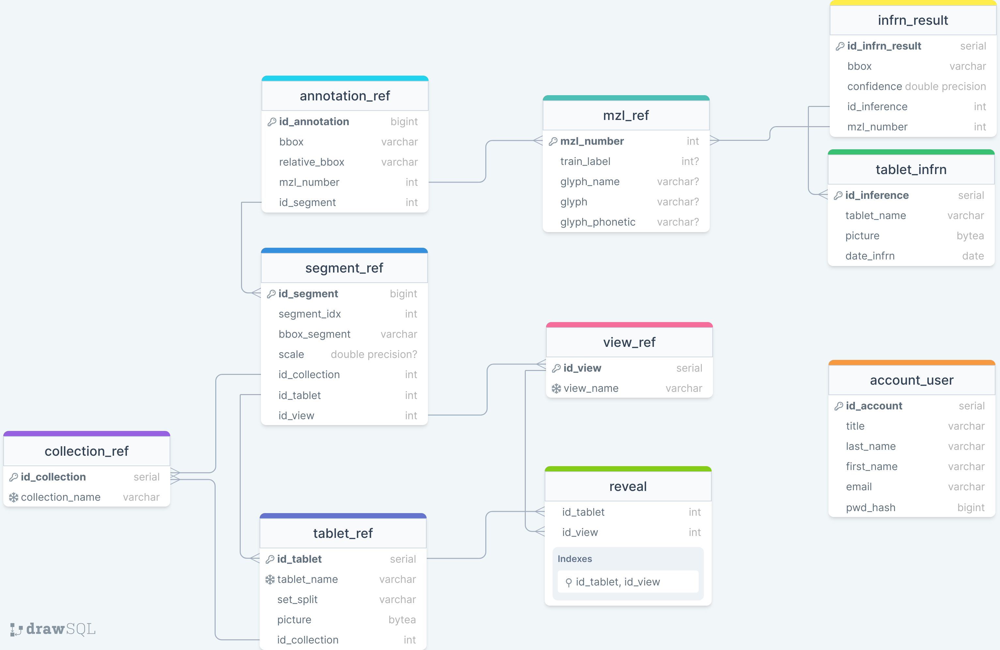

<!-- PROJECT LOGO -->
 

  

   

  

     
     
    <a href="https://www.youtube.com/watch?v=7oSaOvixXqQ"><strong>View Demo</strong></a>
    ·
    <a href="https://github.com/CharleyDL/Aissyr/issues">Report Bug</a>
    ·
    <a href="https://github.com/CharleyDL/Aissyr/issues">Request Feature</a>
  

 

<!-- TABLE OF CONTENTS -->

<a href="#readme-top">back to the main branch</a>

 

<!-- ABOUT THE PROJECT -->

## 📚 - About The Project

 

<blockquote>
  

    <em>
      This project showcases the expertise necessary to achieve the professional qualification of 
        <a href="https://www.francecompetences.fr/recherche/rncp/34757">
          Artificial Intelligence Developer (RNCP 34757)
        </a>
      , as part of the 
        <a href="https://isen-caen.fr/ecole-ia-microsoft-by-simplon-et-isen-ouest/">
          Microsoft IA Caen School by Simplon x ISEN (Engineer School)
        </a>. 
      AIssyr is an original creation by 
        <a href="https://www.linkedin.com/in/charleylebarbier/">
          Charley ∆. Lebarbier
        </a>
    </em>
  

</blockquote>

 
 

    

 

  <em>
    AIssyr Web App is dedicated to researchers to work on the Assyrian 
    cuneiforms writing system, providing a toolbox for glyphs classification and labeling images.
  </em>

 

## - Database

To install >>> <a href="docs/install_guide/1_install_db.md">Read the doc</a> 

